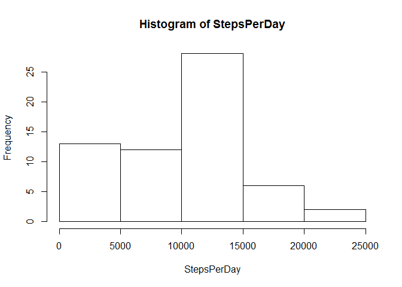
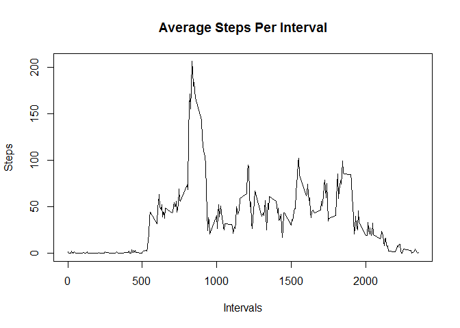
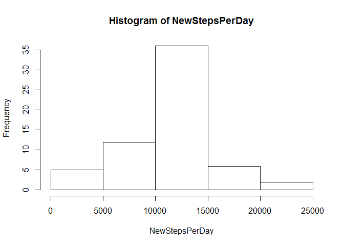

# Reproducible Research: Peer Assessment 1


## Loading and preprocessing the data

We will unzip the file that contains the data and read it into R.

```r
unzip("activity.zip")
fitdata <- read.csv("activity.csv", na.strings = "NA")
```


## What is mean total number of steps taken per day?

We will now calculate the steps taken per day, and graph it in a histogram. 

We will also output the mean and median steps per day, ignoring NA values.


```r
dates <- names(table(fitdata$date))
StepsPerDay <- sapply(dates, function(x){
                      daysubset <- subset(fitdata, fitdata$date == x)
                      sum(daysubset$steps, na.rm = TRUE)  })
hist(StepsPerDay)
```

 

```r
mean(StepsPerDay)
```

```
## [1] 9354.23
```

```r
median(StepsPerDay)
```

```
## [1] 10395
```


## What is the average daily activity pattern?

Take the average steps at each interval for all the days and graph onto a line plot.


```r
Intervals <- as.numeric(names(table(fitdata$interval)))

Steps <- sapply(Intervals, function(x){
  intervalsubset <- subset(fitdata, fitdata$interval == x)
  mean(intervalsubset$steps, na.rm = TRUE)  })

plot(Steps ~ Intervals, type = "l", main = "Average Steps Per Interval")
```

 

We will then return the time interval with the max steps.


```r
stepsvsintervals <- data.frame(Intervals, Steps)
maxsteps <- max(Steps)
maxinterval <- subset(stepsvsintervals, stepsvsintervals[,2] == maxsteps)
maxinterval[,1]
```

```
## [1] 835
```


## Imputing missing values

First, we will find the number of rows with missing values in this dataset.

```r
sum(is.na(fitdata))
```

```
## [1] 2304
```

Our strategy for filling in these missing values will be to use the mean steps for that interval from days where that interval is not missing. A new data frame will be created that copies the original dataset but with the missing data filled in.


```r
nadata <- subset(fitdata, is.na(fitdata$steps))
filleddata <- subset(fitdata, !is.na(fitdata$steps))

navector <- 1:length(nadata$steps)
subdata <-    sapply(navector, function(x){
              intervalmean <- subset(stepsvsintervals, stepsvsintervals[,1] == nadata$interval[x])
              intervalmean[,2]})
nadata$steps <- subdata

fitdatafilled <- rbind(nadata, filleddata)
```

We will now make a histogram ot the total steps taken each day and output the mean and median


```r
NewStepsPerDay <- sapply(dates, function(x){
                      daysubset <- subset(fitdatafilled, fitdatafilled$date == x)
                      sum(daysubset$steps, na.rm = TRUE)  })
hist(NewStepsPerDay)
```

 

```r
mean(NewStepsPerDay)
```

```
## [1] 10766.19
```

```r
median(NewStepsPerDay)
```

```
## [1] 10766.19
```

Comparing the two histograms, imputing missing values by replacing them with the mean steps for that interval normalizes the data and drives it closer to the center, a demonstrated by the closeness of the mean and median and more bell-shaped histogram.


## Are there differences in activity patterns between weekdays and weekends?
